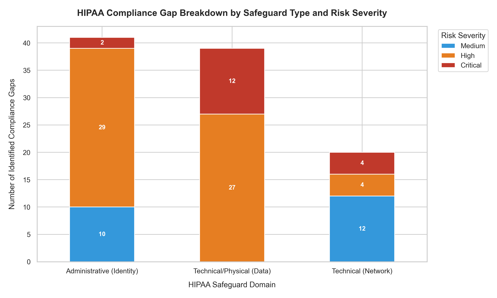

# 🏥 HIPAA GRC Automation Pipeline

> Automated healthcare compliance assessment pipeline that simulates asset inventory, injects security vulnerabilities, maps findings to HIPAA Security Rule + HITRUST CSF, and generates executive-ready audit reporting.


---

## 🚀 Highlights

✔ Simulated 100 enterprise healthcare assets  
✔ Automated vulnerability injection engine  
✔ HIPAA → HITRUST crosswalk generation  
✔ Executive dashboard generation  
✔ Audit-ready compliance outputs

---

## 📸 Dashboard Preview



---

## 📚 Contents

- Project Overview
- Architecture
- Technology Stack
- Dashboard Preview
- Findings
- Execution
- Deliverables
- Author

---

## 🏗 Pipeline Architecture

```text
simulate_assets.py
        ↓
inject_vulnerabilities.py
        ↓
analyze_compliance.py
        ↓
Risk Scoring Engine
        ↓
HIPAA ↔ HITRUST Mapping
        ↓
Dashboard Generation
```

---

## 🧰 Technology Stack

| Layer | Technology |
|---|---|
| Language | Python 3.11 |
| Data Processing | Pandas, NumPy |
| Visualization | Matplotlib |
| Framework Mapping | HIPAA + HITRUST |
| Environment | PowerShell |
| Outputs | CSV, PNG |

---

## 📊 Executive Audit Findings

| Metric | Result |
|---|---:|
| Assets Assessed | 100 |
| Compliance Domains | 3 |
| Critical Findings | 18 |
| High Findings | 60 |
| Dashboard Outputs | 2 |

---


---

## 🔎 Key Risk Insights

### Identity & Access Controls
Highest concentration of findings tied to identity governance gaps including provisioning delays, RBAC weaknesses, and missing MDM enforcement.

### Data Protection
Technical safeguards showed fewer assets but higher severity findings due to production databases and ePHI exposure risk.

### Recommended Actions
- Strengthen IAM governance
- Enforce MFA baseline
- Automate asset inventory
- Implement continuous compliance monitoring

---
## ⚙️ Installation

### 1. Clone Repository

```bash
git clone https://github.com/GeoJordan/hipaa-grc-automation-pipeline.git
cd hipaa-grc-automation-pipeline
```

### 2. (Optional) Create Virtual Environment

Windows:

```bash
python -m venv venv
venv\Scripts\activate
```

Mac/Linux:

```bash
python3 -m venv venv
source venv/bin/activate
```

### 3. Install Dependencies

```bash
pip install pandas numpy matplotlib seaborn
```

### 4. Verify Installation

```bash
python --version
```

Expected:

```text
Python 3.11+
```

---

## ▶ Run Pipeline

Execute the workflow in sequence.

### Step 1 — Generate Healthcare Asset Inventory

Creates a simulated environment of healthcare infrastructure assets.

```bash
python simulate_assets.py
```

Output:

```text
100 simulated assets created
```

---

### Step 2 — Inject Security Threat Scenarios

Simulates infrastructure vulnerabilities and control failures.

```bash
python inject_vulnerabilities.py
```

Output:

```text
Threat scenarios generated
Compliance gaps identified
```

---

### Step 3 — Run HIPAA + HITRUST Assessment

Maps findings to safeguards and builds reporting outputs.

```bash
python analyze_compliance.py
```

Output:

```text
Compliance matrix generated
Dashboard exported
```

---

### Expected Output Files

```text
hipaa-grc-automation-pipeline/
│
├── final_portfolio_compliance_matrix_100.csv
│
└── compliance_risk_dashboard.png
```

Open:

```text
compliance_risk_dashboard.png
```

to review executive-level findings.

---

## 📦 Generated Deliverables

Upon execution, the pipeline generates:

```text
outputs/
│
├── final_portfolio_compliance_matrix_100.csv
│
└── compliance_risk_dashboard.png
```

### Example Outputs

| File | Purpose |
|---|---|
| compliance_matrix.csv | Compliance assessment |
| dashboard.png | Executive reporting |

---

## 👨‍💻 About the Author

**George Jordan**  
GRC • Healthcare Security • Compliance Automation

🔗 LinkedIn: https://linkedin.com/in/geojordan  
🔗 Portfolio: https://asarejordan.com  
🔗 GitHub: https://github.com/GeoJordan

---

⭐ If this project was useful, consider starring the repository.


## 📄 License
This project is open-source and available under the **MIT License**. Feel free to fork, modify, and utilize this pipeline for your own compliance mapping frameworks.
